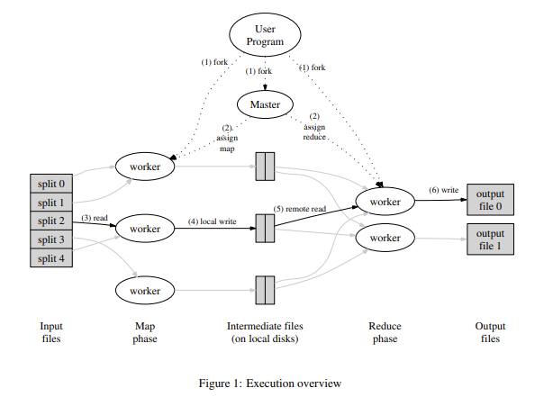

# Tiny MapReduce

## Overview

Q: *Whats MapReduce?*

A: [MapReduce](https://pdos.csail.mit.edu/6.824/papers/mapreduce.pdf) is a distributed programming model developed by Jeffrey Dean and Sanjay Ghemawat at Google in 2004 for processing and generating large data sets with a parallel algorithm on a cluster. It consists of two main steps: 
- the Map step, where the input data is processed and transformed into intermediate key-value pairs.
- the Reduce step, where the intermediate key-value pairs are aggregated to produce the final output.

Although MapReduce as a system is considered a legacy framework today, its programming model's design principles continue to have a significant impact on both industry and academia. The model has influenced the development of modern distributed data processing systems such as Hadoop, Spark, and Flink, and remains a foundational concept for large-scale parallel data processing.



Q: *What does MapReduce solve?*

A: MapReduce provides a framework for processing and generating large data sets on a distributed cluster. It abstracts away the complexities of a distributed system such as parallelization, fault tolerance, data distribution, and load balancing, allowing developers to focus on the map and reduce functions (business core logic). 

In other words, with this kinda framework, teams can build scalable distributed data processing pipelines without requiring every engineer to be an expert in distributed systems.

## Example to Run (Sequential Version)

```bash
# Build the plugin
go build -buildmode=plugin -o build/wc.so ./plugins/wc/

# Build sequential runner
go build -o build/seq ./cmd/sequential/

# Run
cd build
rm -f mr-out*
./seq wc.so ../testdata/pg*.txt

# View sorted output
sort mr-out-0
```

## References

- [MapReduce: Simplified Data Processing on Large Clusters](https://pdos.csail.mit.edu/6.824/papers/mapreduce.pdf)
- [MIT 6.5840 Distributed Systems](https://pdos.csail.mit.edu/6.824/) (previously known as "6.824: Distributed Systems")